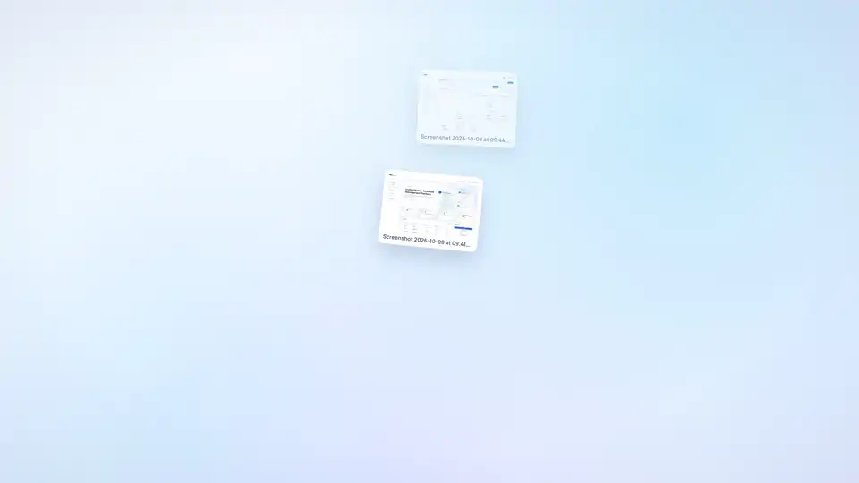
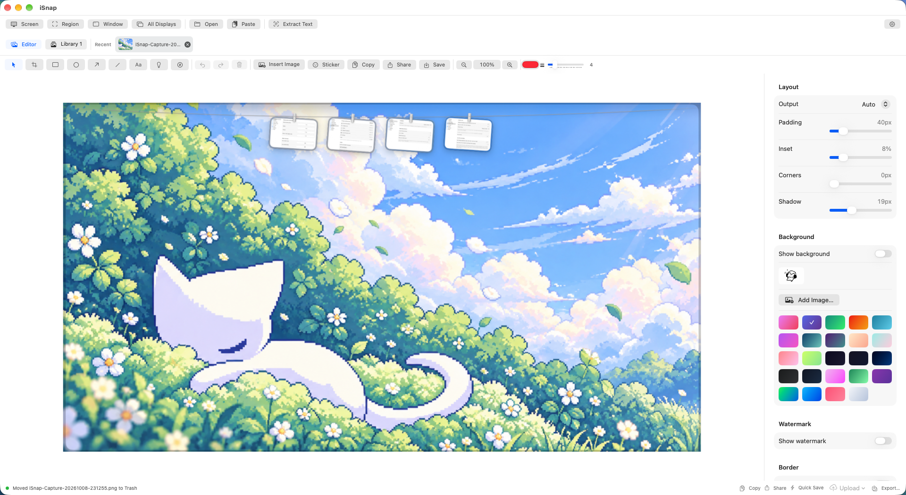
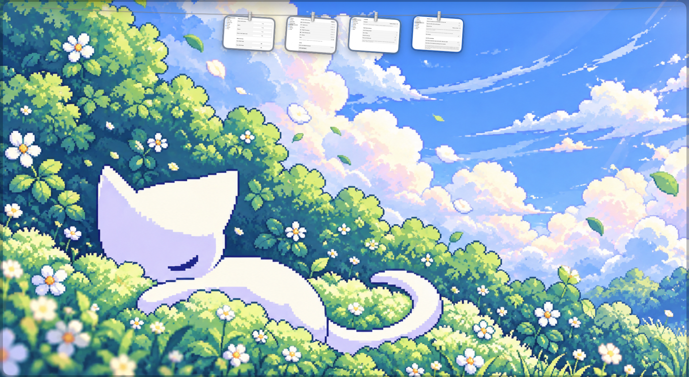
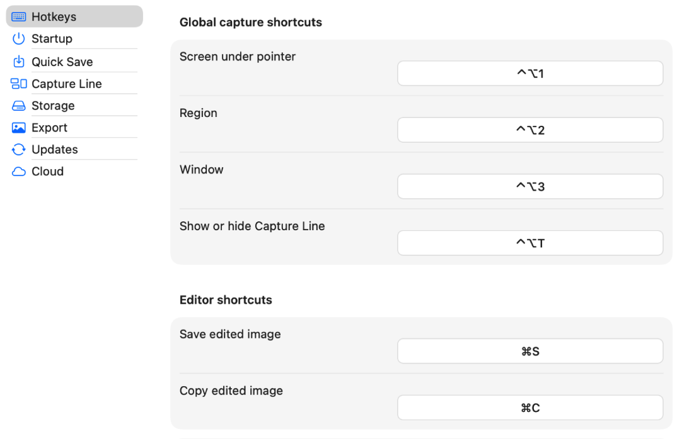
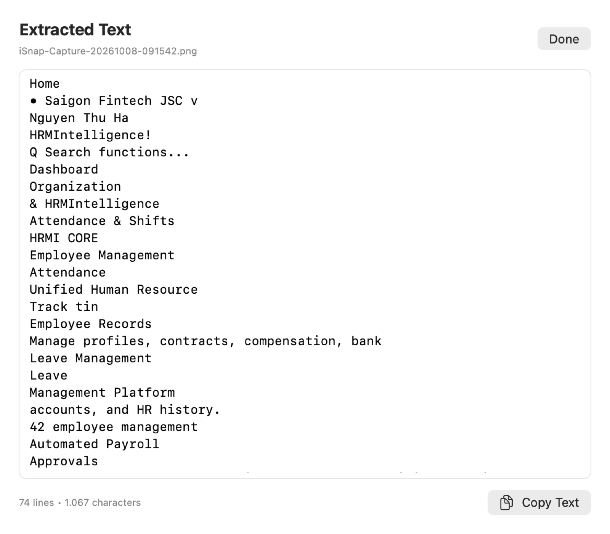
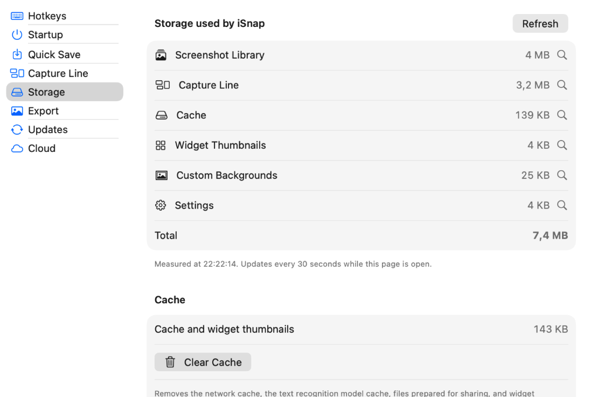

<p align="center">
  
</p>

<h1 align="center">iSnap</h1>

<p align="center"><b>The native macOS screenshot editor.</b><br>Capture any screen, annotate and beautify it, keep every capture hanging on a line under the menu bar, then share it anywhere.</p>

<p align="center">
  <a href="docs/assets/isnap-introduce.mp4"></a>
  <br>
  <sub>▶ <a href="docs/assets/isnap-introduce.mp4">Watch the full 40-second introduction with sound</a> · <a href="docs/USER_GUIDE.md">User guide</a></sub>
</p>

iSnap is written in Swift with SwiftUI, AppKit, and ScreenCaptureKit. No web view, no JavaScript runtime, and nothing leaves your Mac unless you choose to upload it.

## Highlights

### Capture the screen you are looking at

`⌃⌥1` captures the display under the pointer, `⌃⌥2` drags a region on any display, `⌃⌥3` picks an application window, and **All Displays** stitches every screen into one image. Captures open in the editor and are archived to your Library automatically.

### Annotate and beautify

Rectangles, ellipses, arrows (straight or curved), lines, text, numbered or lettered markers, spotlight, image overlays, and emoji stickers, all movable, resizable, and rotatable with undo/redo. Frame the result with 24 gradients or your own background, padding, rounded corners, shadow, border, output ratio, and a text or image watermark. Crop non-destructively.

<p align="center"></p>

### The Capture Line

Every capture flies up and hangs on a line tucked under the menu bar, including screenshots taken with `⇧⌘3/4/5` and clipboard screenshots (`⌃⇧⌘3/4`). Click a card to copy it, double-click to edit it in iSnap, press and hold for Markup, drag it into any app or folder, or use its share button. Choose **Show on Hover**, **Always Show**, or **Hide**, and toggle it any time with `⌃⌥T`.

<p align="center"></p>

### Share anywhere

One Share menu on Capture Line cards, in the editor, and in the Library: AirDrop, Messages, Mail, every macOS share extension, **Open With** any app, copy the image, the file, or its path, or upload to Cloudflare R2, Google Drive, or DocVault and copy the link.

### And more

- **Text extraction (OCR)** on device with macOS Vision, English and Vietnamese
- **Screenshot Library** with recent captures, quick open, reveal, and move to Trash
- **Storage** overview with live sizes per folder and one-click **Clear Cache**
- **Widgets** (small and medium) for recent screenshots
- **English and Tiếng Việt** interface, switchable from the menu bar icon
- PNG/JPEG export, quick save (`⌘S`), copy (`⌘C`), filename patterns, launch at login, and update checks

| Hotkeys | Text extraction | Storage |
| --- | --- | --- |
|  |  |  |

## Requirements

- macOS 14 Sonoma or later
- Screen Recording permission for display and window capture
- To build: Xcode 16 or later (validated with the Xcode 27 SDK) and [XcodeGen](https://github.com/yonaskolb/XcodeGen)

## Install and build

```bash
swift build
swift test
```

Build the app with Xcode:

```bash
xcodegen generate
xcodebuild -project iSnap.xcodeproj -scheme iSnap -configuration Release build
```

Copy the built `iSnap.app` to `/Applications` and open it. For a stable Screen Recording permission, sign with your Apple Development team and always run the copy in Applications. On first capture macOS asks for access; enable iSnap under **System Settings → Privacy & Security → Screen & System Audio Recording**, then restart iSnap from its recovery alert. If an older ad-hoc build is still listed, reset only its record with `tccutil reset ScreenCapture dev.isnap.app`.

See the [user guide](docs/USER_GUIDE.md) for every feature and shortcut.

## Project layout

The source is split into `App`, `Models`, `Services`, and `Views`. System operations sit behind native services, `EditorDocument` owns the editable state, and `ExportRenderer` is the single rendering path for the preview, the clipboard, and exported files. More in [docs/architecture.md](docs/architecture.md).

Documentation screenshots are rendered from the real views with demo data:

```bash
ISNAP_SHOTS_DIR=/tmp/isnap-shots ISNAP_DEMO_DIR=/path/to/demo-images swift test --filter MarketingShotsTests
```

## License and notices

Third-party notices are listed in [THIRD_PARTY_NOTICES.md](THIRD_PARTY_NOTICES.md).
