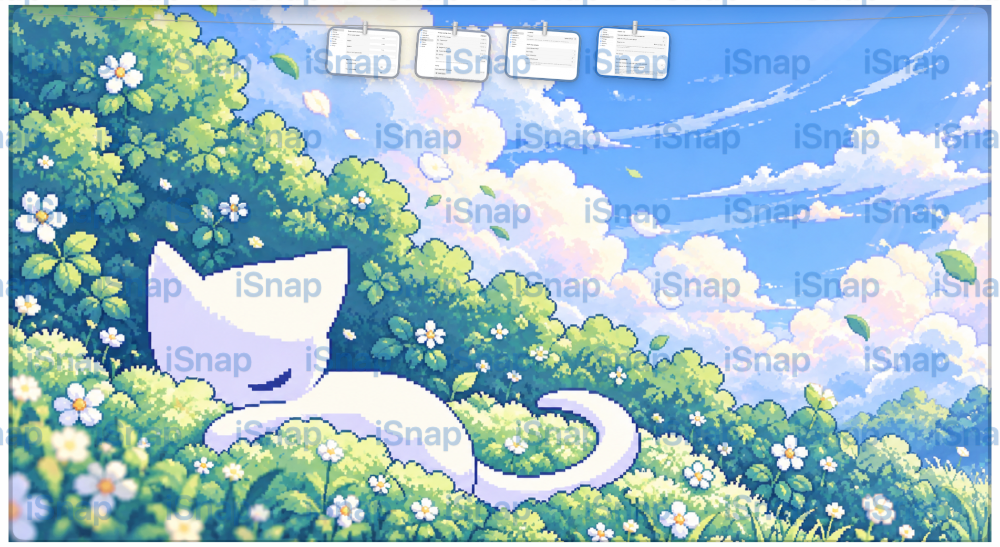
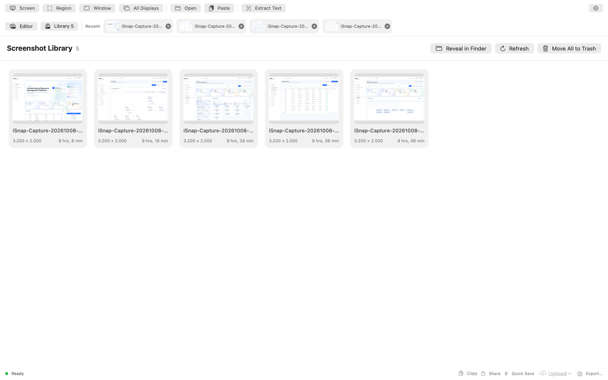
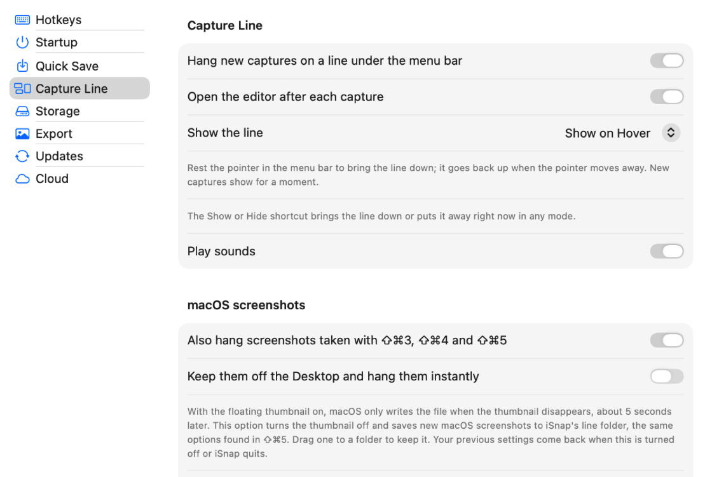

# iSnap user guide

iSnap lives in your menu bar (the viewfinder icon) and in a main window with an editor and a screenshot Library. This guide walks through every feature. For building from source, see the [README](../README.md).

- [Getting started](#getting-started)
- [Capturing](#capturing)
- [Editing](#editing)
- [The Capture Line](#the-capture-line)
- [Sharing](#sharing)
- [Library and widgets](#library-and-widgets)
- [Text extraction](#text-extraction)
- [Cloud uploads](#cloud-uploads)
- [Settings](#settings)
- [Storage and cache](#storage-and-cache)
- [Language](#language)
- [Keyboard shortcuts](#keyboard-shortcuts)
- [Troubleshooting](#troubleshooting)

## Getting started

1. Move `iSnap.app` to `/Applications` and open it. The viewfinder icon appears in the menu bar.
2. Take your first capture with `⌃⌥1`. macOS asks for **Screen Recording** access. Enable iSnap under **System Settings → Privacy & Security → Screen & System Audio Recording**, then choose **Restart iSnap** in the alert that iSnap shows.
3. To pick up screenshots you take with `⇧⌘3/4/5`, iSnap reads the folder macOS saves them to (usually the Desktop). macOS asks once whether iSnap may access that folder.

The menu bar icon gives you everything without opening the window:

| Item | What it does |
| --- | --- |
| Show iSnap | Opens the main window |
| Capture Screen · Region · Window · All Displays | Starts a capture; the current shortcut is shown next to each item |
| Capture Line › | Show on Hover, Always Show, Hide, Show or Hide Now (`⌃⌥T`), Take Everything Down |
| Screenshot Library | Opens the Library |
| Settings… | Opens Settings (`⌘,`) |
| Language › | System Default, English, Tiếng Việt |
| Quit iSnap | `⌘Q` |

## Capturing

| Mode | Default shortcut | Result |
| --- | --- | --- |
| Screen | `⌃⌥1` | The whole display under the pointer. With several displays, point at the one you want. |
| Region | `⌃⌥2` | Every display dims. Drag a rectangle on any of them; the size is shown as you drag. `Esc` cancels. |
| Window | `⌃⌥3` | A picker lists open windows with thumbnails; choose one. |
| All Displays | toolbar or menu | Every display stitched into one image. |

You can also **Open…** (`⌘O`) or **Paste** (`⌘V`) an image into the editor.

After a capture:

- The editor opens with the image (turn this off in **Settings → Capture Line → Open the editor after each capture**).
- The capture is saved to the Library as `iSnap-Capture-<date>-<time>.png` when **Automatically save every capture to Library** is on (Settings → Quick Save).
- The capture flies up to the [Capture Line](#the-capture-line).

All shortcuts can be changed in **Settings → Hotkeys**: click a shortcut, then press a modifier combination plus a letter, number, or F1–F12.

## Editing

<p align="center"></p>

### Tools

| Tool | Key | Notes |
| --- | --- | --- |
| Select | `V` | Move, resize, and rotate annotations. `Delete` removes the selection. |
| Crop | `C` | Non-destructive. Pick a ratio (Free, 16:9, 4:3, 1:1, 9:16, 3:4), then **Apply**; **Reset** restores the original. |
| Rectangle | `R` | Stroke, fill, width, and corner radius from the toolbar. |
| Ellipse | `E` | |
| Arrow | `A` | Drag in any direction; can be curved. |
| Line | `L` | |
| Text | `T` | Click to place, then type in the popup. Double-click to edit later. |
| Number | `N` | Auto-numbered markers. Edit to switch to A, B, C or a, b, c, or to set the next value. |
| Spotlight | `S` | Dims everything outside the shape. |

Also in the toolbar: **Insert Image** (an overlay with its own opacity), **Sticker** (emoji stickers), **Undo**/**Redo**, zoom (pinch on a trackpad, or the zoom buttons; **Fit** resets), **Copy**, **Share**, and **Save**.

### Canvas panel

The panel on the right styles the exported image:

- **Layout:** output ratio (Auto, 1:1, 4:3, 3:2, 16:9, 5:3, 9:16, 3:4, 2:3), padding, inset, corner radius, and shadow.
- **Background:** show or hide it, pick one of 24 gradients, or **Add Image…** for your own (up to eight are kept).
- **Watermark:** text or image, opacity, size, one of nine positions, or **Tile Entire Image**.
- **Border:** color, weight, and position (outside, center, or inside).

<p align="center"></p>

### Saving and exporting

| Action | Shortcut | Where it goes |
| --- | --- | --- |
| Save Edited Image | `⌘S` | The Library folder, named by your filename pattern |
| Export… | `⇧⌘S` | Anywhere, through a save panel |
| Copy Edited Image | `⌘C` | The clipboard, as rendered |
| Share | toolbar or status bar | See [Sharing](#sharing) |

Format (PNG or JPEG), JPEG quality, whether the canvas background is included, and copying after a quick save are set in **Settings → Export**.

## The Capture Line

Captures hang on a line tucked under the menu bar, ready to use without opening a window.

<p align="center"></p>

### Showing the line

Choose a mode from **menu bar icon → Capture Line** or **Settings → Capture Line → Show the line**:

| Mode | Behavior |
| --- | --- |
| **Show on Hover** | Rest the pointer in the menu bar and the line slides down; move away and it goes back up. New captures show for a moment. Clicking elsewhere puts it away. |
| **Always Show** | The line stays down while it has captures. |
| **Hide** | The line never comes down on its own, not even from the menu bar. Captures still hang on it. |

`⌃⌥T` (**Show or Hide Now**) brings the line down or puts it away immediately, in every mode. The line also hides while an app is in full screen.

### Working with a card

| Gesture | Result |
| --- | --- |
| Click | Copy the image |
| Double-click | Edit it in iSnap |
| Press and hold | Open it in the macOS Markup editor; saving writes back to the file |
| Drag into an app | Send a copy; the card stays on the line |
| Drag into a folder | Keep the file there (Library files are copied, never moved) |
| Drag to the Trash, or click the **×** | Take the card down |
| Share button (top right) | Open the [Share menu](#sharing) |
| Right-click | Copy, Edit in iSnap, Markup, Share, Open in Default App, Show in Finder, Save to Desktop, Take Down, Move to Trash |

**Take Everything Down** in the menu clears the line.

### Where captures come from

- **iSnap captures** (`⌃⌥1/2/3`).
- **macOS screenshots** (`⇧⌘3/4/5`), when **Also hang screenshots taken with ⇧⌘3, ⇧⌘4 and ⇧⌘5** is on. With the floating thumbnail on, macOS only writes the file when the thumbnail disappears, about five seconds later. Turn on **Keep them off the Desktop and hang them instantly** to switch the thumbnail off and save new macOS screenshots to iSnap's line folder; your previous screenshot settings come back when you turn it off or quit iSnap.
- **Clipboard screenshots** (`⌃⇧⌘3/4`), when **Also hang screenshots copied to the clipboard** is on. iSnap saves them to its line folder; they stay on the clipboard too. macOS may ask once whether iSnap can paste from other apps.

### What happens to the files

Captures that only live on the line (clipboard screenshots, routed macOS screenshots, and iSnap captures made while Library saving is off) are stored in `~/Library/Application Support/iSnap/Line` and go to the Trash when taken down. Files anywhere else, including your Library, are never deleted from the line. **Save to Desktop** keeps a line-only capture.

## Sharing

The same Share menu is available on Capture Line cards, in the editor toolbar and status bar, and in the Library (right-click → **Share…**). The editor shares the rendered image in your export format.

| Item | What it does |
| --- | --- |
| AirDrop · Messages · Mail | Share directly |
| More Sharing Options | Every macOS share extension (Notes, Photos, Freeform, …) |
| Open With › | Any app that opens images, default app first; **Other…** picks any app |
| Copy Image · Copy File · Copy Path | Paste the picture, attach the file (chat apps, Mail, Finder), or paste its path |
| Upload and Copy Link › | Cloudflare R2, Google Drive, or DocVault (connected services only); the link is copied |
| Show in Finder | Reveal the file |

## Library and widgets

The **Library** shows every image in your Quick Save folder (default `~/Pictures/iSnap`), newest first. Double-click to open one in the editor; right-click for **Share…**, **Reveal in Finder**, and **Move to Trash**. **Move All to Trash** asks first and can be undone from the Trash. The most recent captures also appear in the **Recent** bar above the editor.

<p align="center"></p>

Add the **Recent Screenshots** widget (small or medium) from the macOS widget gallery to open or remove recent captures without opening iSnap.

## Text extraction

**Extract Text** (toolbar, or **Capture → Extract Text from Screenshot**) reads the text in the current image on your Mac with macOS Vision, including English and Vietnamese. **Copy Text** copies the result.

<p align="center"></p>

## Cloud uploads

Configure services in **Settings → Cloud**. Credentials and tokens are stored in the macOS Keychain.

- **Cloudflare R2:** Account ID, Bucket, Public URL, optional Directory, Access Key ID, and Secret Access Key. **Save & Test** checks the connection.
- **Google Drive:** create a Desktop OAuth client that can use the loopback redirect `http://127.0.0.1:8089/callback`, enter its Client ID and Secret, then **Connect**. An optional Folder ID chooses the destination.
- **DocVault:** set the API server and web app, **Connect** to sign in, then choose the upload workspace and the Google Drive account linked in DocVault. Capacity refreshes after uploads.

Upload from the editor status bar (**Upload**) or from any Share menu (**Upload and Copy Link**).

## Settings

| Tab | What you can change |
| --- | --- |
| Hotkeys | Global capture shortcuts, the Capture Line shortcut, and editor Save/Copy shortcuts |
| Startup | Language, launch at login, start hidden, close to menu bar, sound after save |
| Quick Save | Library folder, filename pattern (timestamp, date, increment), automatic saving of captures |
| Capture Line | On/off, opening the editor after captures, display mode, sounds, macOS and clipboard screenshot pickup |
| Storage | Sizes, Clear Cache, Capture Line cleanup |
| Export | Format, JPEG quality, canvas background, copy after quick save |
| Updates | Check on launch, check now |
| Cloud | Cloudflare R2, Google Drive, DocVault |

<p align="center"></p>

## Storage and cache

**Settings → Storage** lists what iSnap keeps on disk: the Screenshot Library, Capture Line files, cache, widget thumbnails, custom backgrounds, and settings, with a total. Sizes refresh every 30 seconds while the page is open; the magnifier shows each location in Finder.

- **Clear Cache** removes the network cache, the text recognition model cache, files prepared for sharing, and widget thumbnails. iSnap rebuilds them when needed. Screenshots, backgrounds, and settings are kept.
- **Move Capture Line Files to Trash…** removes line-only captures after asking. Library screenshots are not touched.

<p align="center"></p>

## Language

Choose **System Default**, **English**, or **Tiếng Việt** from **menu bar icon → Language** or **Settings → Startup → Language**. iSnap offers to restart, which is when macOS loads the new language. Unsaved editor changes are lost on restart, so save first.

## Keyboard shortcuts

| Shortcut | Action |
| --- | --- |
| `⌃⌥1` | Capture the screen under the pointer |
| `⌃⌥2` | Capture a region |
| `⌃⌥3` | Capture a window |
| `⌃⌥T` | Show or hide the Capture Line now |
| `⌘O` / `⌘V` | Open / paste an image |
| `⌘S` / `⇧⌘S` | Save to Library / Export… |
| `⌘C` | Copy the edited image |
| `V` `C` `R` `E` `A` `L` `T` `N` `S` | Select, Crop, Rectangle, Ellipse, Arrow, Line, Text, Number, Spotlight |
| `Delete` | Delete the selected annotation |
| `Esc` | Cancel a region selection |
| `⌘,` | Settings |

The global and Save/Copy shortcuts can be changed in Settings → Hotkeys.

## Troubleshooting

**"Screen Recording access needs attention".** macOS applies the permission to a running app only after a restart. Use **Restart iSnap** in the alert. If an old build is still listed in System Settings, remove it with `tccutil reset ScreenCapture dev.isnap.app` and grant access again.

**macOS screenshots do not appear on the line.** Check **Settings → Capture Line**: the folder iSnap watches is shown under **Watching**. If iSnap cannot read it, allow access in **System Settings → Privacy & Security → Files and Folders**, then **Try Again**. Screenshots copied to the clipboard need the clipboard option, and with the floating thumbnail on the file appears about five seconds after capture.

**The line does not come down.** In **Hide** mode it only appears with `⌃⌥T`. In **Show on Hover**, rest the pointer in the menu bar of the display you are using. It also stays hidden while an app is full screen.

**Diagnostics.** iSnap logs Capture Line activity. Run this in Terminal (use the full path; in zsh, `log` is a built-in):

```bash
/usr/bin/log show --last 10m --info --predicate 'subsystem == "dev.isnap.app"'
```
